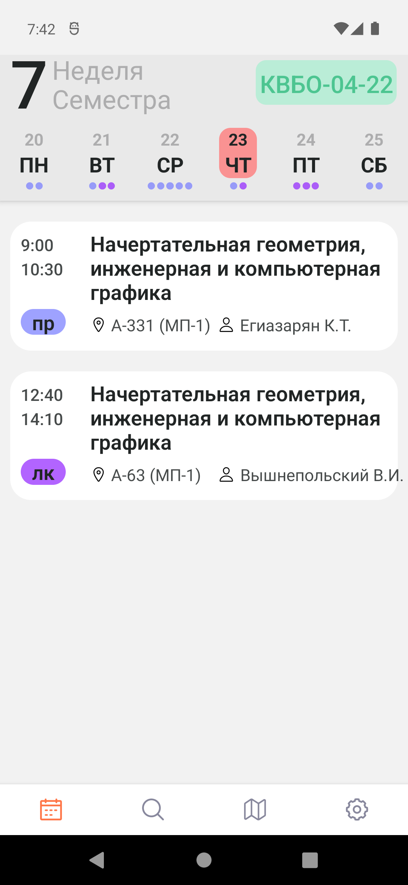
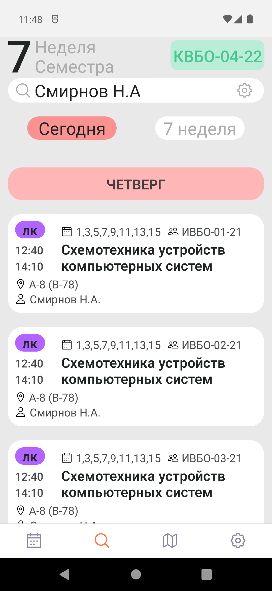
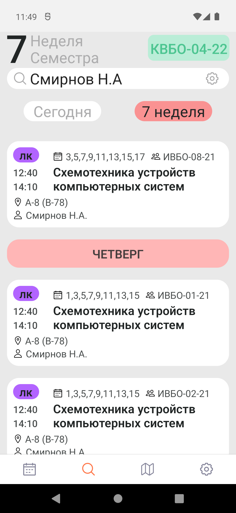
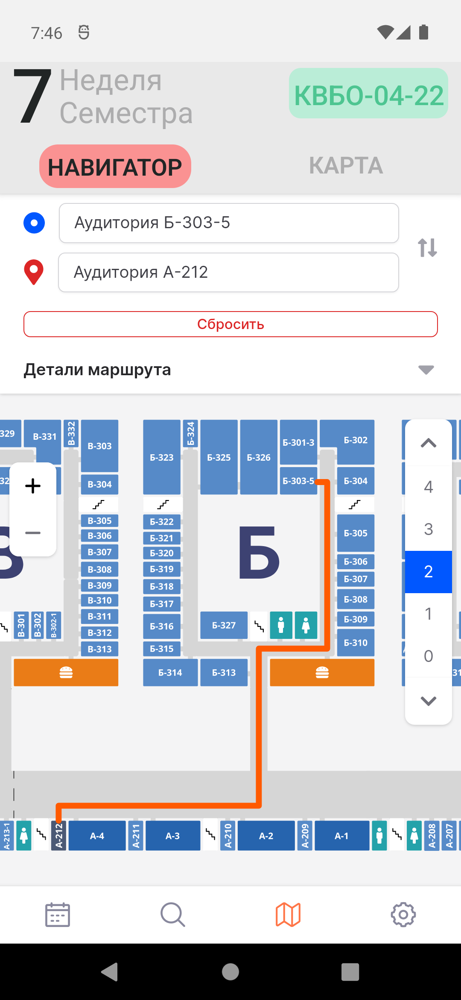
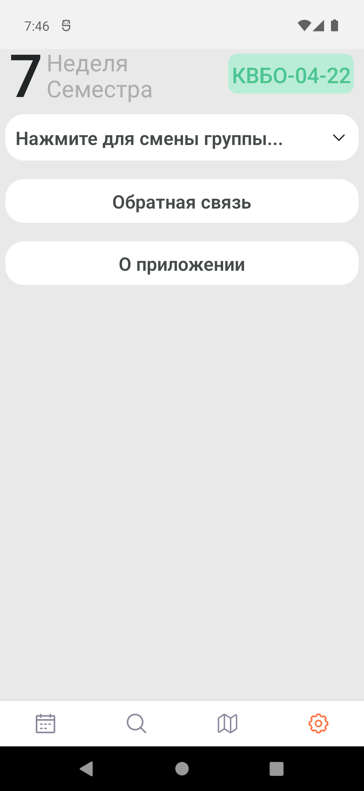

# MIREA-and-TOCHKA

<u>Attention the application does not work until September !1!1!1!1!1!1!1!1!1!1!!!!</u>

The application allows you to view the schedule for study groups of students of the RTU MIREA University. The current academic week of the semester is displayed at the top of the screen.

  
   

Also receive the teacher's schedule for today, the current week or for the entire semester.

  
   

There are two types of maps: navigator and offline map. The navigator allows you to build a route from one room to another. The offline map allows you to orient yourself on the campus of the university even without an Internet connection.

  
   

In the settings, you can change the theme to light or dark. And also change the study group to get the timetable.

  

It has been developed using ReactNative, TypeScript, and Expo,
making it compatible with both Android and iOS platforms.
Currently only available for Android on [Google Play](https://play.google.com/store/apps/details?id=com.pelixpng.Mirea), the iOS version will be released in the fall.

# Resources Used

The all schedule is provided by api [miraea ninja](https://schedule.mirea.ninja/docs#/default)
You can find more information about the mira ninja project on their [GitHub](https://github.com/mirea-ninja)
Map with navigator provided by [ischemes](https://ischemes.ru/group/rtu-mirea/vern78), often unavailable :(
Offline map provided by [mirea.xyz](https://mirea.xyz/scheme).

# How to start ?

1. Copy and open this repository.
2. Generate your development build. [Instruction](https://docs.expo.dev/develop/development-builds/create-a-build/)
3. Install the development build apk on your device or emulator and run the command: "npx expo start --dev-client"
